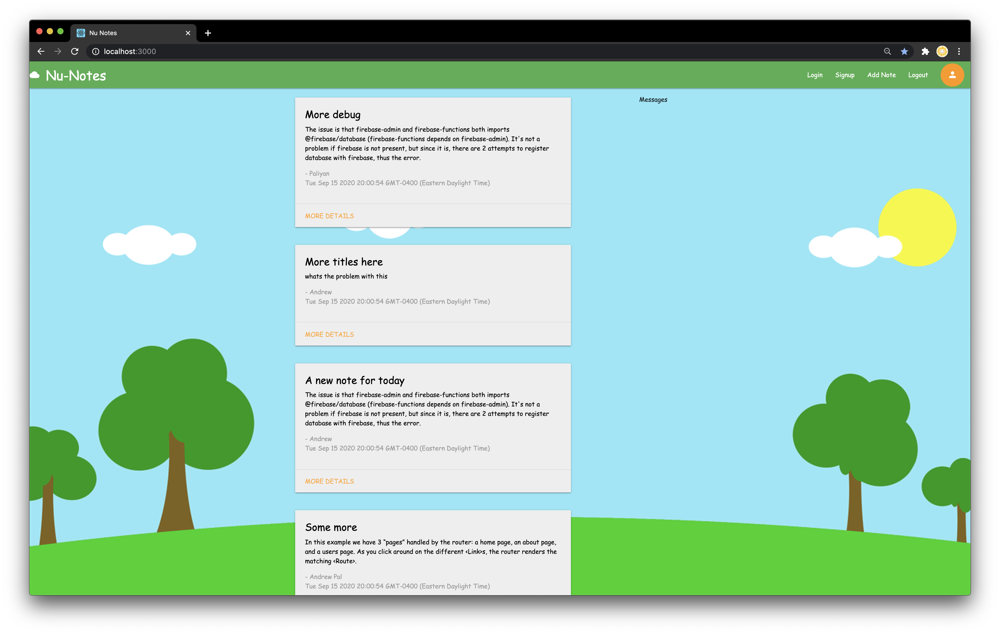

# React Coding - A code walkthough

References:

### Day1: Introduction to Hooks

[More details here.](day1-react-hooks)

https://reactjs.org/docs/hooks-reference.html

### Day2: Redux getting started

https://redux.js.org/introduction/getting-started

https://chrome.google.com/webstore/detail/redux-devtools/lmhkpmbekcpmknklioeibfkpmmfibljd?hl=en

https://github.com/zalmoxisus/redux-devtools-extension

[More details here.](day2-redux-basics)

### Day3: Reducers / Actions / Index DB

Combine Reducers:

https://redux.js.org/api/combinereducers

State to Props:

https://react-redux.js.org/using-react-redux/connect-mapstate

Dispatch to Props:

https://react-redux.js.org/using-react-redux/connect-mapdispatch

Browser - Indexed DB Storage:

https://pouchdb.com/

https://github.com/vicentedealencar/redux-pouchdb

getters and setters in JS:

https://developer.mozilla.org/en-US/docs/Web/JavaScript/Reference/Functions/get

https://developer.mozilla.org/en-US/docs/Web/JavaScript/Reference/Functions/set

Other Libraries:

https://lodash.com/

[More details here.](day3-reducers-props-actions)

### Day4: Introduction to Redux-Saga

[More details here.](day4-saga-sample-app-nu-notes)

### Day5: Introduction to Tests 

[More details here.](day5-tests-app-gallery)