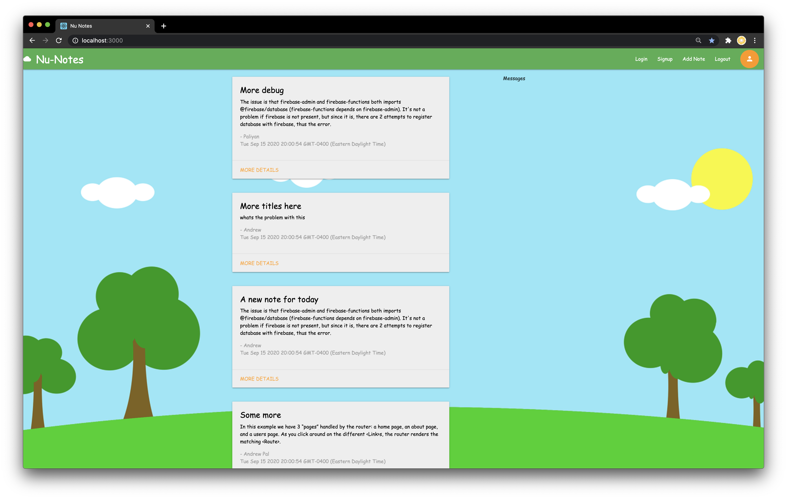
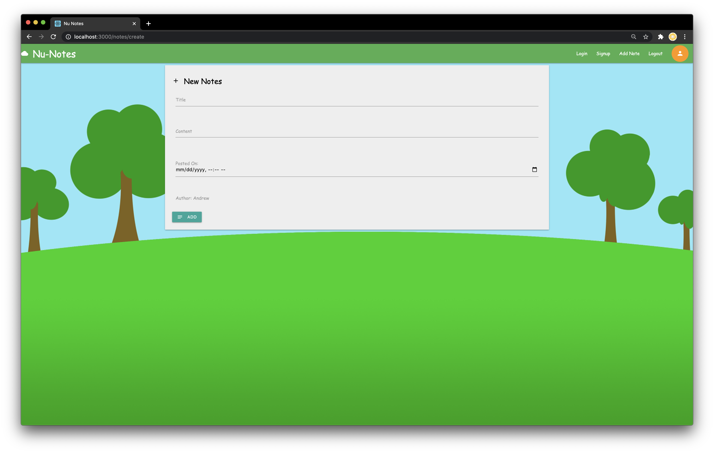

### Font used:
- comic-sans-ms
- material icons

```
<link href="https://fonts.googleapis.com/icon?family=Material+Icons" rel="stylesheet">
<link href="https://allfont.net/allfont.css?fonts=comic-sans-ms" rel="stylesheet" type="text/css" />

```

### Library used: 

https://materializecss.com/


### React Saga for Firebase:

https://redux-saga-firebase.js.org/reference/dev/firestore


React Router:

https://reactrouter.com/web/guides/quick-start

Requires config/reduxSagaFirebase.js to be configured and "notes" firestore table for the code to work